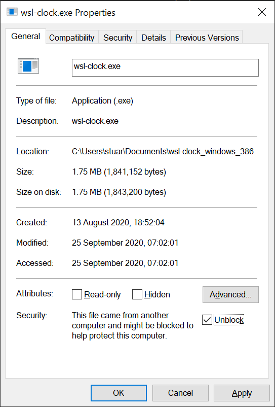

# wsl-clock

**IMPORTANT: This is not an official solution and whilst it worked on my machine this is an unsupported workaround :-)**

There is an issue with WSL where the clock in WSL isn't updated when the host resumes from sleep/hibernate. E.g. [this issue](https://github.com/microsoft/WSL/issues/4245)

This repo has a workaround that creates a scheduled task that is triggered by Windows Events for resuming from sleep/hibernation. When the scheduled task executes it resets the clock in the WSL VM.

For the background to this repo, see [this blog post](https://stuartleeks.com/posts/fixing-clock-skew-with-wsl-2/). The implementation discussed in that blog post is based on PowerShell and that implementation is still available [here](https://github.com/stuartleeks/wsl-clock/tree/powershell). The implementation has now been replaced with a program written in Go, with the following advantages:

* The application runs as a windowless app so there is no longer the flash of a powershell window when the task runs
* The logic has been updated to test for a running WSL v2 distro before checking whether to reset the clock (rather than _any_ running distro). This removes the potential for spinning up a WSL 2 distro when there wasn't one running (i.e. when there was no need to reset the clock)
* The logic now uses an existing running distro for executing the time checks and reset steps, rather than the default distro. This avoids situations where an extra distro may have been started, as well as avoiding issues when the default distro was configured as WSL v1

## Setup

Download the ZIP file for a [prebuilt release](https://github.com/stuartleeks/wsl-clock/releases/latest) and unzip to a local folder.

After unzipping, unblock each to the `.ps1` and `.exe` files by right-clicking, selecting 'Properties', ticking 'Unblock' and clicking 'OK':

To set up the scheduled task, run `add-wslclocktask.ps1` in the content you just unzipped. This will set up a scheduled task triggered on Hibernation Resume events to run the `wsl-clock.exe` to check for clock drift on resuming from hibernation.

## Cleanup

To remove the scheduled task, run `remove-wslclocktask.ps1`

## Logs/Troubleshooting

The program invoked by the scheduled task logs output to `~/.wsl-clock.log`

## Building from source

The simplest way to build from source is to use [Visual Studio Code](https://code.visualstudio.com) and open as a [devcontainer](https://code.visualstudio.com/docs/remote/containers). This will run the development environment with the required version of Go and allow you to run `make build` to build the binary.

